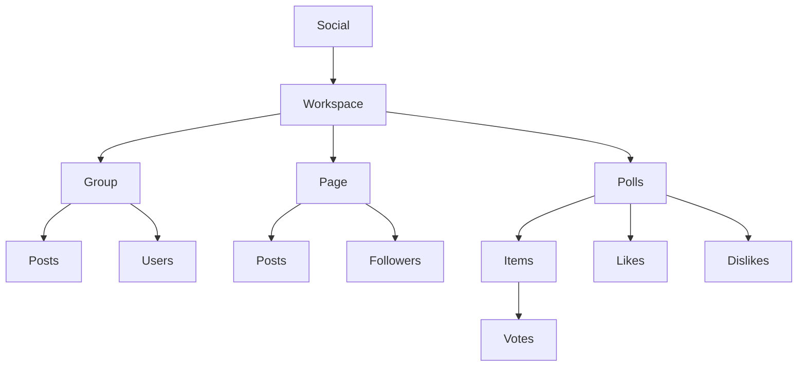
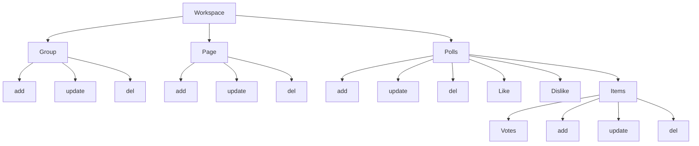

# Social Module
### Simple management of Social

#### Module Dependencies

1. [**App**](https://github.com/DviDev/app-module)
2. [**Base**](https://github.com/DviDev/app-module)
3. [**Workspace**](https://github.com/DviDev/workspace-module)

#### Module Optional Relations

1. [**DBMap**](https://github.com/DviDev/dbmap-module)
2. [**Project**](https://github.com/DviDev/project-module)

###### Social

###### Social Actions

### Test / Validations
1. Workspace
   1. Create
      1. Field validations
         1. workspace_id
            1. [ ] required
            2. [ ] int
            3. [ ] exist
         2. visibility
            1. [ ] exist in list
         3. owner_user_id
            1. [ ] required
            2. [ ] int
            3. [ ] exist
   2. Update
      1. Field validations
         1. id
            1. [ ] required
            2. [ ] int
            3. [ ] exist
         2. workspace_id
             1. [ ] required
             2. [ ] int
             3. [ ] exist
         2. visibility
             1. [ ] exist in list
         3. owner_user_id
             1. [ ] required
             2. [ ] int
             3. [ ] exist
   3. Delete
       1. id
           1. [ ] required
           2. [ ] int
           3. [ ] exist
2. Group
    1. Create
        1. Field validations
           1. workspace_id
              1. [ ] required
              2. [ ] int
              3. [ ] exist
           2. visibility
              1. [ ] exist in list
              2. [ ] required
           3. name
              1. [ ] required
              2. [ ] min length: 3
              3. [ ] max length: 100
           4. cover_image_path
              1. [ ] max length: 255
    2. Update
       1. Field validations
           1. id
               1. [ ] required
               2. [ ] int
               3. [ ] exist
           2. workspace_id
               1. [ ] required
               2. [ ] int
               3. [ ] exist
           2. visibility
               1. [ ] exist in list
               2. [ ] required
           3. name
               1. [ ] required
               2. [ ] min length: 3
               3. [ ] max length: 100
           4. cover_image_path
               1. [ ] max length: 255
    3. Delete
        1. id
            1. [ ] required
            2. [ ] int
            3. [ ] exist
3. Group Post
    1. Create
        1. Field validations
           1. group_id
              1. [ ] required
              2. [ ] exist
           2. post_id
              1. [ ] required
              2. [ ] exist
    2. Update
       1. Field validations
           1. id
               1. [ ] required
               2. [ ] int
               3. [ ] exist
           2. group_id
              1. [ ] required
              2. [ ] exist
           3. post_id
               1. [ ] required
               2. [ ] exist
    3. Delete
        1. id
            1. [ ] required
            2. [ ] int
            3. [ ] exist
4. Group User
    1. Create
        1. Field validations
           1. group_id
              1. [ ] required
              2. [ ] int
              3. [ ] exist
           2. user_id
              1. [ ] required
              2. [ ] int
              3. [ ] exist
    2. Update
       1. Field validations
           1. id
               1. [ ] required
               2. [ ] int
               3. [ ] exist
           2. group_id
               1. [ ] required
               2. [ ] int
               3. [ ] exist
          3. user_id
              1. [ ] required
              2. [ ] int
              3. [ ] exist
    3. Delete
        1. id
            1. [ ] required
            2. [ ] int
            3. [ ] exist
5. Pages
    1. Create
        1. Field validations
           1. workspace_id
              1. [ ] required
              2. [ ] int
              3. [ ] exist
           2. created_by_user_id
              1. [ ] required
              2. [ ] int
              3. [ ] exist
           3. visibility
              1. [ ] required
              2. [ ] exist in list
           4. name
              1. [ ] required
              2. [ ] min length: 2
              3. [ ] max length: 150
           5. image_cover_path
              1. [ ] max length: 150
    2. Update
       1. Field validations
           1. id
               1. [ ] required
               2. [ ] int
               3. [ ] exist
           2. workspace_id
               1. [ ] required
               2. [ ] int
               3. [ ] exist
           3. created_by_user_id
               1. [ ] required
               2. [ ] int
               3. [ ] exist
           4. visibility
               1. [ ] required
               2. [ ] exist in list
           5. name
               1. [ ] required
               2. [ ] min length: 2
               3. [ ] max length: 150
           6. image_cover_path
               1. [ ] max length: 150
    3. Delete
        1. id
            1. [ ] required
            2. [ ] int
            3. [ ] exist
6. Page Followers
    1. Create
        1. Field validations
           1. page_id
              1. [ ] required
              2. [ ] exist
           2. user_id
              1. [ ] required
              2. [ ] exist
    2. Update
       1. Field validations
           1. id
               1. [ ] required
               2. [ ] int
               3. [ ] exist
           2. page_id
               1. [ ] required
               2. [ ] exist
           3. user_id
               1. [ ] required
               2. [ ] exist
    3. Delete
        1. id
            1. [ ] required
            2. [ ] int
            3. [ ] exist
7. Page Post
    1. Create
        1. Field validations
           1. page_id
              1. [ ] required
              2. [ ] int
              3. [ ] exist
           2. post_id
              1. [ ] required
              2. [ ] int
              3. [ ] exist
    2. Update
       1. Field validations
           1. id
               1. [ ] required
               2. [ ] int
               3. [ ] exist
           2. page_id
               1. [ ] required
               2. [ ] int
               3. [ ] exist
           3. post_id
               1. [ ] required
               2. [ ] int
               3. [ ] exist
    3. Delete
        1. id
            1. [ ] required
            2. [ ] int
            3. [ ] exist
8. Poll
    1. Create
        1. Field validations
           1. description
              1. [ ] required
              2. [ ] min length: 2 words
              3. [ ] max length: 255
    2. Update
       1. Field validations
           1. id
               1. [ ] required
               2. [ ] int
               3. [ ] exist
           2. description
               1. [ ] required
               2. [ ] min length: 2 words
               3. [ ] max length: 255
    3. Delete
        1. id
            1. [ ] required
            2. [ ] int
            3. [ ] exist
9. Poll item
    1. Create
        1. Field validations
           1. poll_id
              1. [ ] required
              2. [ ] int
              3. [ ] exist
           2. name
              1. [ ] required
              2. [ ] min length: 1
              3. [ ] max length: 80
    2. Update
       1. Field validations
           1. id
               1. [ ] required
               2. [ ] int
               3. [ ] exist
           2. poll_id
               1. [ ] required
               2. [ ] int
               3. [ ] exist
           3. name
               1. [ ] required
               2. [ ] min length: 1
               3. [ ] max length: 80
    3. Delete
        1. id
            1. [ ] required
            2. [ ] int
            3. [ ] exist
10. Poll item vote
    1. Create
       1. Field validations
          1. poll_item_id
             1. [ ] required
             2. [ ] exist
          2. user_id
             1. [ ] required
             2. [ ] exist
    2. Update
       1. Field validations
           1. id
               1. [ ] required
               2. [ ] int
               3. [ ] exist
           2. poll_item_id
               1. [ ] required
               2. [ ] exist
          2. user_id
              1. [ ] required
              2. [ ] exist
    3. Delete
        1. id
            1. [ ] required
            2. [ ] int
            3. [ ] exist
